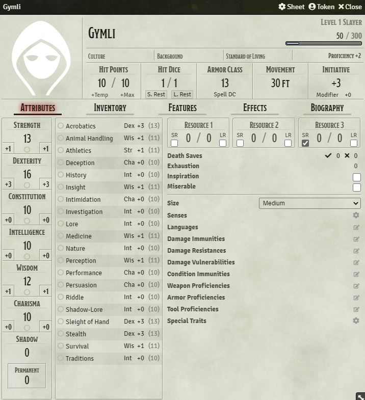
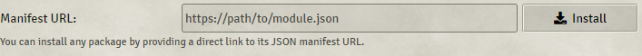

# Adventures in Middle-Earth
Adventures in Middle-Earth (AiME) is a module for Foundry VTT's DND5E system. It allows players to play DND5E using the rules from Cubicle 7's Lord of the Rings system: Adventures in Middle-Earth.


<a href="https://ko-fi.com/dwinther"></a>

## Regarding Foundry V10

The module should now be completely compatible with Foundry V10. Please don't hesitate to open a new [issue](https://gitlab.com/dwinther/aime-module/-/issues) if you find any bugs.

## Features
Currently the module overrides the default 5e character sheet with one, more closely resembling the one from AiME.



The module adds 2 new ability scores: Shadow and Permanent (Shadow), and adds the skills: Lore, Riddles, Shadow-Lore and Traditions, while removing the 5e Arcana and Religion skills from the game.

Languages from AiME also replaces the default 5e languages, as does the currencies and their respectable conversions.

No content (creatures, items, etc.) is included in this module. It aims purely to create a framework for players to use the AiME rules in Foundry VTT.

## Installation
Make sure you have the dnd5e system installed, then copy ```https://raw.githubusercontent.com/ZWinther/aime-module/master/module.json``` and paste it in the manifest url field in Foundry:



### **Warning**: Actors/worlds made with this module enabled, will most likely break if it's disabled.

Treat it as an "expansion pack" to the DnD5e system. "Save games" made with the expansion enabled won't run without it.
Always backup your world data before enabling :)

## Compatibility

I do my best to keep the module up-to-date with both the latest Foundry version and the latest updates to the 5e system. Sometimes the updates will break something and depending on my work and daily life, it might take a little while to make a fix. Creating an issue [here](https://gitlab.com/dwinther/aime-module/-/issues) will keep me informed about what I need to fix.

Module compatibility is a tricky one. Most modules that work for 5e have a good chance of working for AiME, **BUT**, modules that interact with ability score, skills and currency are particularly prone to breaking, due to the changes made in AiME. Some are easily fixed, some are damn near impossible for me. Open an [issue](https://gitlab.com/dwinther/aime-module/-/issues) about the incompatible module and I'll see what I can do.

Currently compatible with the **default 5e sheet**, **Tidy5e sheet** and **Monster Blocks npc sheet**.

Incompatible with the **Merchant Sheet NPC** module.

## Acknowledgements

This module is built on the work of Minas, the creator of the [Foundry 0.7.x version of the module](https://gitlab.com/miketremp/aime-module), who in turn built their module on the work of [Alakar](https://gitlab.com/alakar1/aime-module). I also would not have been able to make this work without the help from the lovely folks in the League of Extraordinary FoundryVTT Developers Discord.

## License

This module is a fan project, and its author is in no way affiliated with or endorsed by Cubicle 7 or Middle-earth Enterprises.
